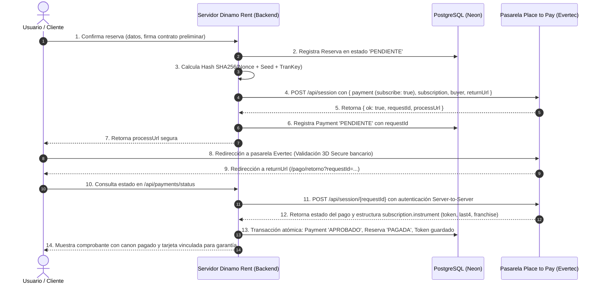
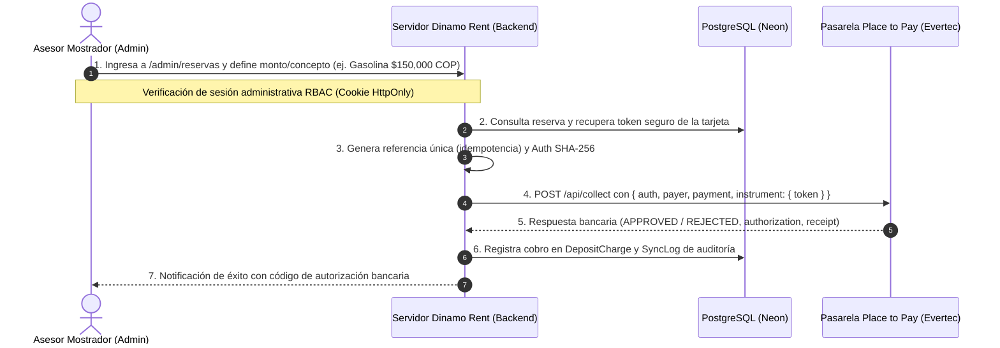

# Documento de Homologación Técnica y de Seguridad
## Integración Pasarela de Pagos Place to Pay (Evertec)
### Modelo: Hosted Checkout + Suscripción (Tokenización) + Collect
### Dinamo Rent a Car Cartagena de Indias

---

**Empresa:** Dinamo Rent a Car  
**Ubicación:** Cartagena de Indias, Bolívar, Colombia  
**Proyecto:** Plataforma Web Transaccional y Reservas en Línea (`dinamo_rent_web`)  
**Proveedor Pasarela:** Place to Pay (Evertec Colombia)  
**Tipo de Integración:** Checkout Redirección Seguro (Hosted Payment Page) con Tokenización de Tarjetas (`subscription`) y Cobros Posteriores Server-to-Server (`/api/collect`)  
**Nivel de Cumplimiento PCI-DSS:** SAQ A (Servidores de Dinamo Rent 100% exentos de datos de tarjetahabientes)  
**Fecha de Elaboración:** Septiembre 2026  
**Versión del Documento:** 1.1.0 (Homologación y Paso a Producción con Suscripción)

---

## 1. Resumen Ejecutivo y Justificación del Modelo

**Dinamo Rent a Car** es una empresa dedicada al alquiler de vehículos turísticos y corporativos con base de operaciones en Cartagena de Indias (Aeropuerto Internacional Rafael Núñez CTG, sedes hoteleras y urbanas).

En el modelo de negocio de alquiler de vehículos en Colombia, el servicio de **Preautorización (Hold / Retención temporal de cupo)** no se encuentra actualmente habilitado por las entidades adquirentes bancarias. En respuesta y siguiendo las directrices técnicas de **Evertec / Place to Pay**, se ha implementado el modelo oficial y certificado de **Suscripción (Tokenización de Tarjetas)** en combinación con el servicio Server-to-Server **`/api/collect`**.

### Este modelo resuelve dos necesidades operativas críticas:
1. **Cobro del Canon de Alquiler:** El cliente paga el valor correspondiente a los días de alquiler, seguros y accesorios seleccionados mediante la pasarela segura.
2. **Depósito de Garantía sin Fricción:** En la misma sesión de checkout, el cliente autoriza la suscripción (tokenización) de su tarjeta de crédito/débito. Esto permite a Dinamo Rent respaldar la garantía del vehículo sin congelar cupo bancario anticipadamente al usuario, manteniendo la capacidad de procesar cobros justificados posteriores (deducibles de siniestros, combustible faltante, días adicionales de retraso o multas de tránsito) mediante llamadas seguras Server-to-Server.

---

## 2. Topología de Arquitectura y Tecnologías

El sistema implementa una arquitectura moderna, desacoplada y con defensas criptográficas multicapa:

```
[ Cliente / Navegador Web ]
           │
           │  HTTPS / TLS 1.3
           ▼
[ Frontend + Backend: SvelteKit 2 (Node.js) ]
  • Validación estricta de contratos y firmas digitales
  • Generación de firmas criptográficas CSPRNG (Nonce + Seed + SHA-256)
  • Orquestación de sesiones de pago y tokenización
           │
           ├──────────────────────────────┬──────────────────────────────┐
           │ HTTPS (API REST Evertec)     │ TLS 1.3 (Pooler Seguro)      │ API Token Auth
           ▼                              ▼                              ▼
[ Pasarela Place to Pay (Evertec) ]  [ Base de Datos Neon PG ]   [ Sync Mostrador ]
• Procesamiento bancario 3DS          • PostgreSQL Serverless    • Software Local
• Ambiente certificado PCI-DSS Nivel 1 • Tokens y auditoría       • Mostrador Aeropuerto
• Bóveda de tarjetas (Tokenización)   • Registros inmutables
```

### Componentes Técnicos:
* **Framework Web & API Gateway:** SvelteKit 2 + TypeScript + Vite.
* **Entorno de Ejecución:** Node.js en ambiente seguro con cifrado TLS 1.3 forzado.
* **Base de Datos Principal:** PostgreSQL alojada en Neon Serverless (`sslmode=require`, cifrado en reposo y en tránsito).
* **ORM:** Prisma con tipado estricto y soporte transaccional atómico (`$transaction`).
* **Seguridad Criptográfica:** Módulo nativo `node:crypto` de Node.js (algoritmo CSPRNG de 16 bytes y SHA-256).

---

## 3. Modelo de Integración: Hosted Checkout con Suscripción

Dinamo Rent a Car implementa el modelo **Hosted Checkout (Redirección)** con estructura combinada de `payment` + `subscription`.

### Ventajas de Seguridad:
1. **Cumplimiento Estricto PCI-DSS SAQ A:** El cliente digita los 16 dígitos de su tarjeta (PAN), fecha de expiración y código CVV **exclusivamente dentro de los servidores seguros de Evertec**, amparados por su certificación PCI-DSS Nivel 1.
2. **Cero Exposición de Datos Financieros:** Dinamo Rent **nunca recibe, nunca procesa, nunca transmite y nunca almacena números de tarjeta ni códigos CVV**.
3. **Manejo de Tokens Criptográficos Opacos:** Evertec devuelve un `token` alfanumérico que únicamente tiene validez dentro de la plataforma de Evertec para el comercio autorizado.

---

## 4. Flujo Transaccional Paso a Paso

El ciclo de vida del alquiler y el respaldo de garantía se divide en dos fases operativas:

### 4.1 Fase 1: Reserva, Pago del Canon y Tokenización de Garantía (Checkout)



### 4.2 Fase 2: Ejecución de Cobros de Garantía / Incidentes (`/api/collect`)

Si al devolver el vehículo no hay novedades ni daños, **no se realiza ningún cargo adicional**.

En caso de requerirse cobro por deducible, combustible o días extra:



---

## 5. Especificación de Endpoints y Payloads de Evertec

### 5.1 Estructura del Objeto de Autenticación Dinámica (`auth`)
Cada llamada saliente a las API de Place to Pay genera una cabecera criptográfica fresca:

```json
{
  "login": "P2P_LOGIN_ASIGNADO",
  "tranKey": "BASE64_SHA256(rawNonce + seed + secretKey)",
  "nonce": "NONCE_BASE64_16_BYTES_CSPRNG",
  "seed": "2026-09-21T18:00:00.000Z"
}
```

* **Mitigación de Replay Attacks:** Cada petición utiliza un `nonce` aleatorio de 16 bytes emitido por `crypto.randomBytes(16)` y un `seed` ISO 8601 que expira en minutos según la tolerancia de Evertec. La llave secreta `secretKey` jamás se transmite en texto claro.

### 5.2 Creación de Sesión con Suscripción (`POST /api/session`)

```json
{
  "auth": { ... },
  "locale": "es_CO",
  "buyer": {
    "name": "Juan",
    "surname": "Pérez",
    "email": "juan.perez@email.com",
    "mobile": "+573001234567",
    "documentType": "CC",
    "document": "1047123456"
  },
  "payment": {
    "reference": "DIN-189201-4412",
    "description": "Alquiler Dinamo Rent — Renault Duster Iconic (4 días)",
    "amount": {
      "currency": "COP",
      "total": 680000
    },
    "subscribe": true
  },
  "subscription": {
    "reference": "SUB-DIN-189201-4412",
    "description": "Garantía y respaldo de vehículo — Dinamo Rent #DIN-189201-4412"
  },
  "expiration": "2026-09-21T19:00:00.000Z",
  "returnUrl": "https://dinamorent.com/pago/retorno",
  "ipAddress": "190.131.x.x",
  "userAgent": "Mozilla/5.0 DinamoRent/1.0"
}
```

### 5.3 Extracción del Token en la Consulta de Sesión (`POST /api/session/{requestId}`)

Evertec entrega en la respuesta la confirmación del canon y los datos del instrumento tokenizado:

```json
{
  "status": {
    "status": "APPROVED",
    "reason": "00",
    "message": "La petición ha sido aprobada exitosamente",
    "date": "2026-09-21T18:05:00.000Z"
  },
  "payment": [
    {
      "status": { "status": "APPROVED" },
      "reference": "DIN-189201-4412",
      "amount": { "currency": "COP", "total": 680000 },
      "authorization": "AUTH-789412",
      "franchise": "VISA",
      "lastDigits": "4242"
    }
  ],
  "subscription": {
    "status": { "status": "APPROVED" },
    "instrument": [
      { "keyword": "token", "value": "e07ca9986cf0ecac8a557fa11c07bf37ea35e9e3e3a4180c49" },
      { "keyword": "last_digits", "value": "4242" },
      { "keyword": "franchise", "value": "visa" },
      { "keyword": "valid_until", "value": "2029-12-31" }
    ]
  }
}
```

### 5.4 Cobro Posterior Server-to-Server (`POST /api/collect`)

```json
{
  "auth": { ... },
  "payer": {
    "name": "Juan",
    "surname": "Pérez",
    "email": "juan.perez@email.com",
    "documentType": "CC",
    "document": "1047123456",
    "mobile": "+573001234567"
  },
  "payment": {
    "reference": "COL-DIN-189201-GAS-01",
    "description": "Dinamo Rent: GASOLINA — Combustible faltante (Reserva #DIN-189201-4412)",
    "amount": {
      "currency": "COP",
      "total": 120000
    }
  },
  "instrument": {
    "token": {
      "token": "e07ca9986cf0ecac8a557fa11c07bf37ea35e9e3e3a4180c49"
    }
  },
  "ipAddress": "190.131.x.x",
  "userAgent": "DinamoRentAdmin/1.0 Server-Collect"
}
```

---

## 6. Cumplimiento de Normativa PCI-DSS

### 6.1 Criterio SAQ A (Self-Assessment Questionnaire A)
* Dinamo Rent a Car externaliza el 100% de la captura de instrumentos financieros hacia Place to Pay (Evertec).
* **PAN (Primary Account Number de 16 dígitos):** NO se almacena, NO se procesa ni viaja por nuestros servidores.
* **CVV / CVC:** NO se almacena ni se procesa.
* **PIN Bancario:** NO se almacena ni se procesa.
* **Datos Almacenados Únicamente con Fines de Facturación y Auditoría:**
  * `token`: Cadena aleatoria no reversible emitida por Evertec.
  * `cardBrand`: Franquicia (ej. `VISA`, `MASTERCARD`).
  * `cardLast4`: Enmascaramiento oficial de auditoría (ej. `4242`).
  * `authorization`: Código de autorización emitido por la red bancaria.
  * `transactionId` y `requestId`: Identificadores únicos de sesión de Evertec.

---

## 7. Políticas de Seguridad y Prevención de Fraude

1. **Protección contra Cobros Duplicados (Idempotencia):**
   * Evertec valida que no existan cobros idénticos en menos de 24 horas sobre la misma referencia y monto.
   * Dinamo Rent genera referencias estructuradas únicas: `COL-{reservationCode}-{timestamp}`.
2. **Control de Acceso Administrativo (RBAC):**
   * El endpoint `/api/payments/collect` está protegido con verificación criptográfica HMAC-SHA256 de sesión administrativa con cookies `HttpOnly`, `SameSite=Lax` y `Secure`.
3. **Trazabilidad y Consentimiento:**
   * En el paso 3 de la reserva, el cliente firma digitalmente aceptando el débito de deducibles o gasolina justificados.
   * En el paso 4 se informa con total claridad que la tarjeta queda vinculada como respaldo sin congelamiento previo de cupo.
   * Cada cargo ejecutado se registra de forma inmutable en la tabla `deposit_charges` con el usuario administrativo que autorizó la operación.

---

## 8. Guía de Preguntas Frecuentes para el Comité de Seguridad de Evertec

| Pregunta de Evertec | Respuesta Técnica de Dinamo Rent a Car |
|---|---|
| **¿Por qué utilizan el modelo de Suscripción en lugar de Preautorización?** | Debido a que la preautorización no se encuentra habilitada para el comercio adquirente en Colombia, Evertec recomendó el uso de Suscripción (Tokenización) para garantizar el respaldo del depósito de garantía del vehículo y procesar cobros de contingencias mediante `/api/collect`. |
| **¿En algún momento Dinamo Rent manipula datos de tarjeta sin tokenizar?** | No. Tanto el pago del canon como la suscripción inicial ocurren 100% dentro del Hosted Checkout de Evertec bajo protocolo 3D Secure. Nuestro servidor solo recibe el `token` resultante. |
| **¿Cómo garantizan que un cobro posterior con token esté justificado?** | La reserva cuenta con firma digital del contrato preliminar y aceptación de términos. Además, el endpoint `/api/payments/collect` requiere autenticación administrativa estricta y genera registros de auditoría en PostgreSQL con el concepto (deducible, gasolina, mora). |
| **¿Cómo manejan la idempotencia en `/api/collect`?** | Cada llamada a `/api/collect` genera un código de referencia irrepetible (`COL-{codigoReserva}-{timestamp}`), aprovechando la ventana de protección de 24 horas de Evertec. |
| **¿Qué ambientes tienen configurados?** | Disponemos de ambientes parametrizados mediante `P2P_ENV`: `test` apunta a `checkout-test.placetopay.com` y `prod` a `checkout.placetopay.com`. Pasar a producción requiere únicamente el cambio de variables de entorno seguras. |

---

## 9. Contactos del Equipo de Desarrollo

* **Líder de Proyecto & Arquitectura Técnica:** Equipo de Tecnología Dinamo Rent a Car
* **Correo de Contacto Técnico:** `tecnologia@dinamorent.com` / `reservas@dinamorent.com`
* **Cartagena de Indias, Colombia**
